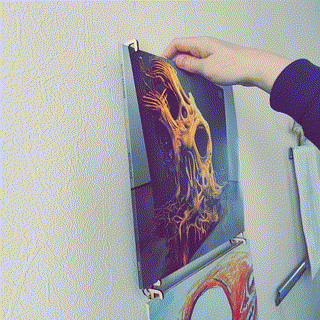
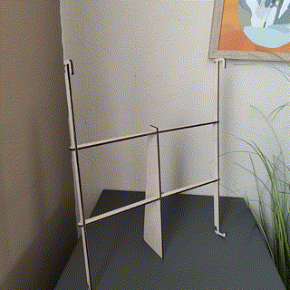
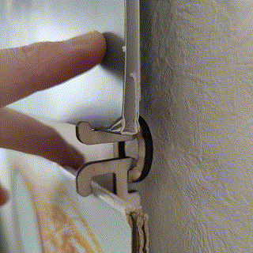
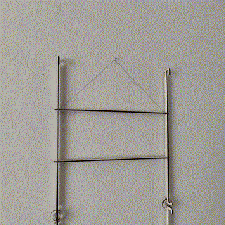
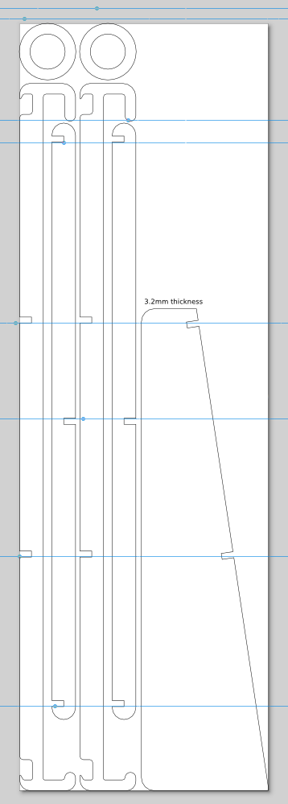
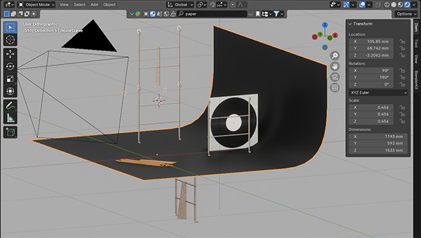
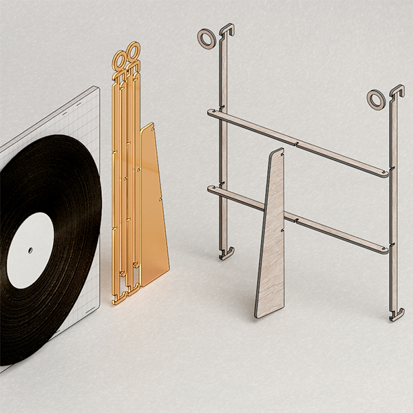
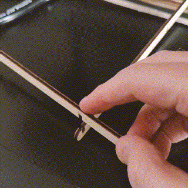

# Vinyl-record-wall-holder

I made my own version based on a picture my son sent me from a record store.

This looked like and is a very basic / easy design, yet I enjoyed taking my time.

After seeing that design from the shop I decided to change:

- The fact that the og design required to slide the record in and out from the side.

Lift up & tilt:

- Adding a stand

Only one stand to keep it minimal, not super solid, but it works well enough:

- The general idea of the frame and the rings I kept. 

Hang one with the rings, or use thread, connect more frames with the rings:

  

## How it was made

My logic isn't yours. >_<

From idea > to Blender sketch > to cardboard > to Inkscape > Lasercut > Blender animation 

### Inkscape

For simple design intended to lasercut, I like to use Inkscape, at one point I'll learn some actual CAD.

- Use the View Outline modus and 0mm line thickness to preserve exact measurements.
  - For easy inkscape designing I give my **shapes and lines no infill, and a line width of 0mm**;
  - this ensures that when sizing, resizing the absolute size is never altered.
- I also make use of guidelines and magnetic snapping.
- Align and distribute can be easier than measuring
- Live path effects has the option for giving custom shapes rounded corners (like Adobe's Illustrator)

### Blender

I first used Blender with some basic blocky sketches based on the first measurements.

Only after finishing the design in Inkscape I imported the SVG in Blender and made the animation. Clearly just for the fun of it.

One handy 'hack' that I used to repeat some animations: use one frame to put something out of frame, or pop it back in and another object out. This way I did not have to make animations in between when repeating.

## Lasercuting: Made for 3.2mm thickness

The press-fit mounting was made with the Kerf of my machine in mind and for plywood with a 3.2mm thickness.
This might need adjusting if your material is different / or you have a different kerf.

- I Could have optimized the cut by joining straight lines together to save time/material. But this is even more work when thinking of kerf.
- The snapfit was ideal for my machine, I can mount and unmount without the need of extra force or glue.

